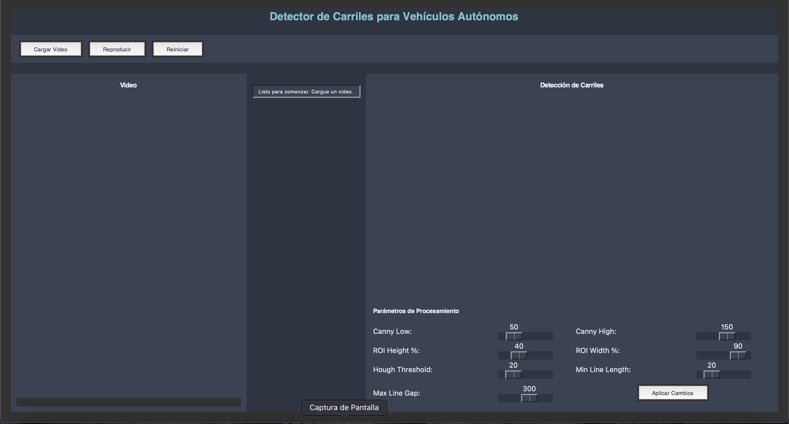
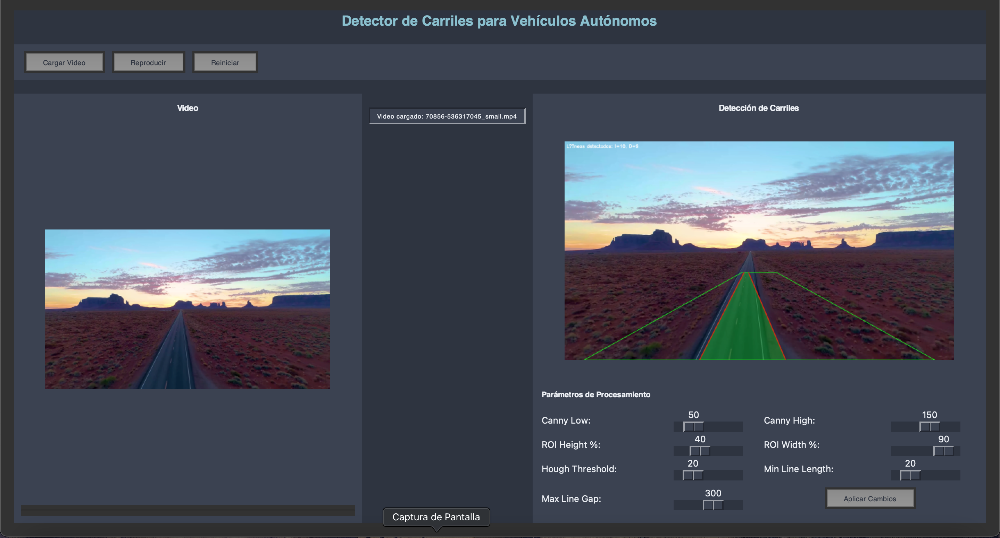
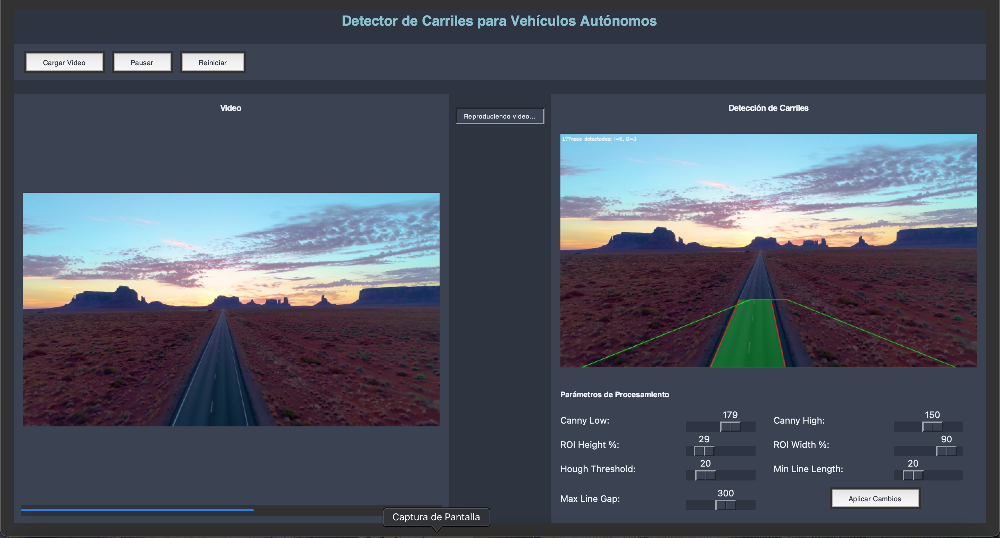

<h1 align="center">🚗 Lane Detection System for Autonomous Vehicles</h1>
<p align="center">
  <em>A Python application with Tkinter UI for lane detection in videos using OpenCV and Hough Transform</em>
</p>

<p align="center">
  
  
  
  
</p>

---

## 🌟 About the Project
**Lane Detection System** is a Python application designed to detect road lanes in videos for autonomous driving research.  
It provides a **graphical interface with real-time video visualization**, dynamic parameter adjustment, and lane detection using **Canny Edge Detection** and **Hough Transform**.

---

## ✨ Features
✔ **Load video files** (MP4, AVI, MOV, MKV)  
✔ **Real-time lane detection** using OpenCV  
✔ **Adjustable processing parameters** (Canny thresholds, ROI size, Hough transform values)  
✔ **Dual view panels**:
- Original video
- Processed video with detected lanes  
✔ **Playback controls**: Play, Pause, Reset  
✔ **Progress bar and status updates**  

---

## 📸 Screenshots
| Home Screen | Video Run 1 | Video Run 2 |
|-------------|------------|------------|
|  |  |  |

---

## 🛠 Tech Stack
- **Language:** Python 3.x  
- **UI:** Tkinter  
- **Computer Vision:** OpenCV  
- **Visualization:** PIL, Matplotlib  
- **Other:** NumPy  

---

## ✅ Requirements
Install the dependencies:
```bash
pip install opencv-python numpy pillow matplotlib
